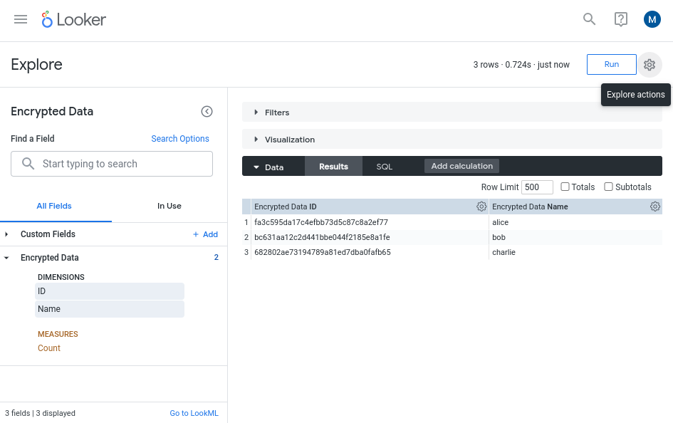

# BQ Column Level Encryption and Looker

This repository is intended as an example of how to encrypt sensitive data in BigQuery and use it in Looker. For more information have a look at the [official documentation](https://cloud.google.com/bigquery/docs/column-key-encrypt).

## Terminology

**DEK** (Data Encryption Key) — this is the key that is used for encrypting & decrypting the sensitive data and needs to be kept secret.

**KEK** (Key Encryption Key) — this is the key that is used to for encrypting and decrypting the DEK, not the data. Stored securely in [Cloud Key Management Service (KMS)](https://cloud.google.com/kms/docs/key-management-service) and can only be accessed by specific users (configured through IAM permissions).

**Wrapped key** — this is the DEK encrypted by the KEK. No need to keep it secret as you need access to the KEK to decrypt it.

## Setting up the KEK

Assuming that you have the correct set of permissions, you can create a key-ring and then add a key to it.

```shell
REGION=...
KEY_RING=...
KEY_NAME=...
gcloud kms keyrings create $KEY_RING --location=$REGION
gcloud kms keys create $KEY_NAME \
    --location=$REGION \
    --keyring=$KEY_RING \
    --purpose=encryption
```

## Generating the wrapped key

There are multiple ways of doing this, but we'll use the `tinkey` utility. Follow the instructions [here](https://developers.google.com/tink/install-tinkey) to install it. Once it's installed run the following command to generate the wrapped key. This is typically a one-off process.

> **Note**  Although generating the wrapped key is a one-off process, uou might need to rotate it to improve your security, see section [Rotating keys](#rotating_keys) below for detailed instructions on that.

```shell
KEK_URI=`gcloud kms keys describe \
    --location=$REGION \
    --keyring=$KEY_RING $KEY_NAME \
    --format="value(name)"`
tinkey create-keyset \
    --key-template=AES256_SIV \
    --out-format=json \
    --out=wrapped_key.json \
    --master-key-uri="gcp-kms://$KEK_URI"
```

## Using the wrapped key for encyrption

Now we've got the wrapped key, we can use it to encrypt the sensitive data. This could be a stand alone application running on premises (as long KMS is accesible) or a service running in the cloud (Dataflow jobs, Cloud Functions). 

In this example we've prepared a sample Python script that you can run from the Cloud Shell. Before you run it, make sure that there's a BigQuery dataset & table:

```shell
PROJECT_ID=
BQ_DATASET=...
BQ_TABLE=...
bq mk --location=$REGION --dataset "$PROJECT_ID:$BQ_DATASET"
bq mk --table "$PROJECT_ID:$BQ_DATASET.$BQ_TABLE" "id:STRING,name:BYTES"
```

Once the table is there, you can insert some encrypted sample data:

```shell
python3 -m venv .venv
source .venv/bin/activate
pip install -r requirements.txt
python encrypt.py \
    --project=$PROJECT_ID \
    --dataset=$BQ_DATASET \
    --table=$BQ_TABLE \
    --wrapped-key-path=wrapped_key.json \
    --kek-uri=$KEK_URI
```

In order to view the encrypted data you can run a SQL query:

```shell
$ bq query --use_legacy_sql=false "SELECT * FROM \`${PROJECT_ID}.${BQ_DATASET}.${BQ_TABLE}\`"
+----------------------------------+------------------------------------------+
|                id                |                   name                   |
+----------------------------------+------------------------------------------+
| fa3c595da17c4efbb73d5c87c8a2ef77 |     AWAgxHgBiS+/UweRFgjRkBeOhIlvROv8Wbs= |
| bc631aa12c2d441bbe044f2185e8a1fe |         AWAgxHi9A0PoraW9TINwTg2QqzAKZLTz |
| 682802ae73194789a81ed7dba0fafb65 | AWAgxHgtS5DrHe0FHRxfJMchE/b0OVy+HBAEVg== |
+----------------------------------+------------------------------------------+
```

## Accessing the data in Looker

In order to see the data in cleartext in Looker, you need to use the [AEAD functions](https://cloud.google.com/bigquery/docs/reference/standard-sql/aead_encryption_functions) from BigQuery in the dimension definition. Before you do that, store the KEK uri and the wrapped key contents (as bytes) as constants in your `manifest.lkml`.

### Extracting the wrapped key contents as a byte literal
In order to get the wrapped key contents as bytes you could use the following commands:

```shell
KEYSET_B64=`jq -r .encryptedKeyset wrapped_key.json`
bq query --use_legacy_sql=false --format=json "SELECT FORMAT('%T', FROM_BASE64('$KEYSET_B64')) AS key_literal" | \
    jq -r .[0].key_literal
```

Once you have the wrapped key as bytes literal you can store it (without the `b` prefix) as a constant.

```lookml
constant: key_resource_uri {
  value: "gcp-kms://projects/.../locations/.../keyRings/.../cryptoKeys/..."
}
constant: wrapped_key {
  value: "\n$\x00\x9c\xdaB\xda...."
}
```

Once these have been defined, you can reference them in your `view` file.

> **Note**  We're passing the wrapped key content as a byte literal to BigQuery, hence the `b` prefix before the reference to the wrapped key.

```lookml
dimension: name {
    type: string
    sql: 
        DETERMINISTIC_DECRYPT_STRING(
            KEYS.KEYSET_CHAIN(
                "@{key_resource_uri}", 
                b"@{wrapped_key}"
            ),
            ${TABLE}.name,
            ""
        ) ;;
}
```

Make sure that the Looker service account that's accessing BigQuery has the _Cloud KMS CryptoKey Decrypter Via Delegation_ role.

Now when the contents for the `name` column are displayed, the data will be automatically decrypted using the wrapped key and the KEK.



## Rotating the keys

For symmetric encryption, periodically and automatically rotating keys is a recommended, and in some cases even required, security practice. Since we're using wrapped keys, this process involves rotating both the KEK and the wrapped key.

### Rotate the KEK

Rotating the KEK is a simple process, you need to create a new version of the key and promote that to be the primary so that whenever that key is used the latest version is used. Keep in mind the command below doesn't automatically disable or destroy the old keys, those are still accessible for decrypting data that has been encoded with the older version of the key. You might want to schedule destroying/disabling those versions once everything that has been encrypted with those versions have been re-encrypted with the new version. It's also possible to schedule automatic rotation of the KEK. For more information on key rotation, have a look at the [relevant parts of the Cloud KMS documentation](https://cloud.google.com/kms/docs/rotate-key).

```shell
gcloud kms keys versions create \
    --key=$KEY_NAME \
    --keyring=$KEY_RING \
    --location=$REGION \
    --primary
```

### Rotate the wrapped key

Next step is to re-create a new DEK and wrap it with the new KEK. Fortunately `tinkey` utility provides a command to rotate the wrapped key. Note that the rotated key will still contain the older version of the wrapped key as well so that you can still decrypt old data. Any encryption on new data will be done with the latest version of the wrapped key.

```shell
tinkey rotate-keyset \
    --key-template=AES256_SIV \
    --in-format=json \
    --in=wrapped_key.json \
    --out-format=json \
    --out=rotated_wrapped_key.json \
    --master-key-uri="gcp-kms://$KEK_URI"
```

You can now extract the rotated & wrapped key as described in section [extracting the wrapped key](#extracting-the-wrapped-key-contents-as-a-byte-literal).

### Re-encrypt the data

Rotating a key doesn't change anything for the data that has been already encrypted. In order to make sure that this data cannot be decrypted anymore with the old keys you need to re-encrypt it.

There are multiple methods to re-encrypt the data, varying from running the encryption code with the new key on the original data, to decrypting with the old key and re-encrypting with the new key as the rotating the key keeps a reference to the old key (until the old one is disabled/destroyed). The snippet below is an example of how to do this in BigQuery with SQL.

```sql
DECLARE kek_resource_uri STRING;
DECLARE wrapped_key_bytes BYTES;
DECLARE encrypted_content BYTES;
SET kek_resource_uri = "gcp-kms://projects/.../locations/.../keyRings/.../cryptoKeys/...";
SET wrapped_key_bytes = FROM_BASE64("....");  -- or the bytes literal as used in Looker

-- Replace the $variables with the corresponding values before running
UPDATE `$BQ_DATASET.$BQ_TABLE` SET name = DETERMINISTIC_ENCRYPT(
            KEYS.KEYSET_CHAIN(kek_resource_uri, wrapped_key_bytes), 
            DETERMINISTIC_DECRYPT_STRING(KEYS.KEYSET_CHAIN(kek_resource_uri, wrapped_key_bytes), name, ''), 
            ''
        )
WHERE 1=1;
```